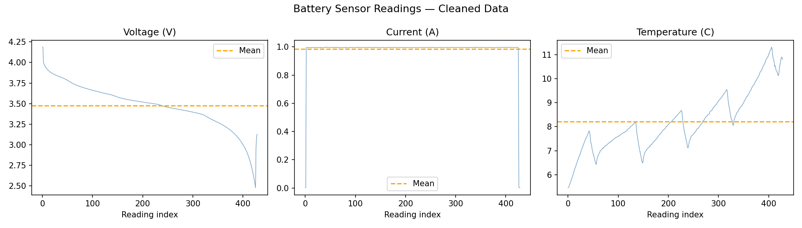
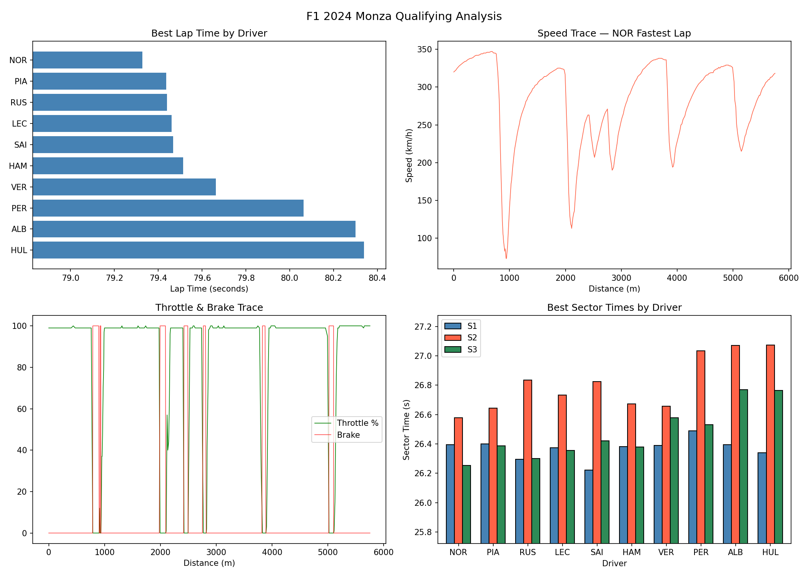
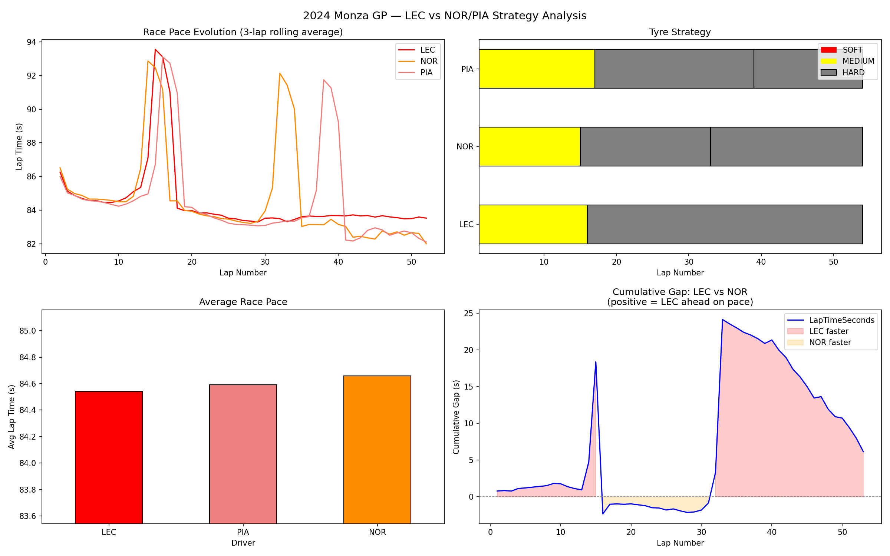

# Machine Learning Projects

This repository showcases my Machine Learning projects using tools such as 
NumPy, Pandas and PyTorch. I link my projects to my real world passion for 
motorsports by creating relevant tools that can be used in racing teams.

---

## 01 — NumPy

### Battery Sensor Data Analyser
A NumPy-based data processing pipeline for cleaning and analysing real Li-ion 
battery discharge data from the NASA Ames Prognostics Center of Excellence. 
Inspired by BMS work on a Formula Student electric vehicle.

**What it does**
- Loads real Li-ion battery discharge data from the NASA Ames 
  Prognostics Center of Excellence (Battery 00005 dataset)
- Applies domain-based physical limits to filter invalid readings
- Normalises data across sensors using Z-score standardisation
- Identifies the most anomalous readings using a composite anomaly score
- Visualises cleaned sensor traces with mean baseline

**Concepts demonstrated**
- Boolean masking for outlier removal
- Broadcasting and axis-based normalisation
- Vectorised operations (no loops over data)
- argsort-based anomaly ranking
- Z-score standardisation

**Background**
During my Formula Student work I debugged electrical faults in a real EV 
powertrain. This project applies the same fault-detection logic 
programmatically using NumPy.

**Stack:** Python · NumPy · Pandas · Matplotlib
**Data:** [NASA Li-ion Battery Aging Dataset](https://www.kaggle.com/datasets/patrickfleith/nasa-battery-dataset)

**How to run**
1. Clone the repo
2. Install dependencies: `pip install numpy matplotlib pandas openpyxl`
3. Open the notebook in VS Code or Jupyter
4. Run All cells

📓 [View Notebook](01-numpy/Battery%20Sensor%20Data%20Analyser.ipynb)

---

## 02 — Pandas

### F1 Telemetry Analysis — 2024 Monza GP

A Pandas-based telemetry analysis pipeline using real F1 timing and 
car data from the FastF1 API. Built around the 2024 Italian Grand Prix 
— one of the most strategically interesting races of the season.

#### The Story
At the 2024 Monza GP, Charles Leclerc won from P4 on the grid by 
executing a 1-stop strategy while Lando Norris and Oscar Piastri — 
the faster McLarens on raw pace — opted for a 2-stop strategy that 
cost them the victory. This project uses real F1 data to quantify 
exactly what happened and why the strategy worked.

#### Qualifying Analysis

- Driver pace comparison and gap to pole
- Sector time breakdown — who was fastest in each sector
- Speed trace and throttle/brake telemetry of the fastest lap
- Driving breakdown — full throttle %, braking %, coasting %

#### Race Analysis

- Tyre strategy visualisation — LEC 1-stop vs NOR/PIA 2-stop
- Race pace evolution across all stints
- Tyre degradation per compound and stint
- Cumulative lap time gap — LEC vs NOR across the full race
- Strategy cost analysis — time lost in the pit lane vs tyre advantage gained

**Concepts demonstrated**
- DataFrame loading, exploration and cleaning
- Timedelta conversion and time-based feature engineering
- Boolean masking and targeted dropna for lap filtering
- groupby and agg for multi-driver performance analysis
- Rolling averages for pace smoothing
- pd.cut for tyre age categorisation
- Bridging Pandas to NumPy for telemetry calculations
- Multi-panel Matplotlib visualisation

**Stack:** Python · Pandas · NumPy · FastF1 · Matplotlib  
**Data:** [FastF1 API](https://theoehrly.github.io/Fast-F1/)

**How to run**
1. Clone the repo
2. Install dependencies: `pip install pandas numpy fastf1 matplotlib`
3. Create the cache folder: `mkdir 02-pandas/f1_cache`
4. Open `F1 Telemetry Project.ipynb` in VS Code or Jupyter
5. Run All cells — first run will download session data (~200MB cached locally)

📓 [View Notebook](02-pandas/F1%20Telemetry%20Project.ipynb)

---

## 03 — Scikit-learn
*Coming soon*

---

## 04 — PyTorch
*Coming soon*
